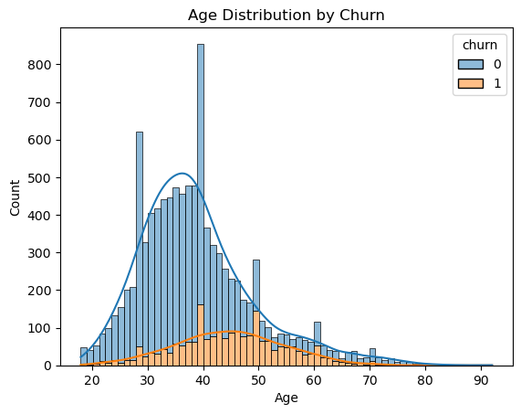

# Banking Churn Rate Analysis and Prediction Project

## Introduction
This project provides an interactive Excel dashboard for analyzing customer churn in the banking sector. It allows users to explore various factors that contribute to churn rates, including salary, tenure, and age.
In addition to the interactive dashboard, the project also includes advanced analysis using Python libraries like Matplotlib and Seaborn for visualizations. Furthermore, machine learning techniques are applied to predict churn rates based on the provided data, offering valuable insights for churn management.

### Excel Dashboard
This repository contains an interactive Excel dashboard for Banking Churn Project. The dashboard helps analyze and visualize data efficiently.

#### Features
- Interactive graphs: Analyze churn rates by factors like Estimated Salary, Tenure, and Age.
- Country breakdown: View customer numbers and churn rates for different countries.
- Churn Rate Correlation: Visualize the relationship between churn and factors like age, salary, and tenure.

#### Preview

#### How to Use
1. Download the `.xlsx` file.
2. Open it in Microsoft Excel.
3. Follow the instructions included in the file.

### Machine Learning Prediction

#### Explore Data Analysis
- MIssing vlaues and Visualization

#### Data Preprocessing
- Add dummy values and separe train and test data. 

#### Modeling and Tuning
- Logistic Regression and Random Forest

- Model tuning by RandomizedSearchCV
  

#### Feature Importances
<<<<<<< HEAD

# Bank-churn-project

### Project Overview
This project focuses on predicting customer churn for a bank using machine learning techniques. By identifying at-risk customers, the bank can implement targeted retention strategies to reduce churn and increase customer loyalty.

### Objectives
- Develop a predictive model to classify customers as "churn" or "non-churn."
- Evaluate model performance using accuracy, precision, recall, and F1 score.
- Provide actionable insights to help the bank retain customers.

### Model Training:
- Algorithms explored: Logistic Regression, Random Forest, Gradient Boosting
- Hyperparameter tuning: GridSearchCV

### Evaluation Metrics:
- Accuracy, Precision, Recall, F1 Score

### Prediction performance
Test Set Performance:
Accuracy : 0.8285
Precision: 0.8482
Recall   : 0.8285
F1 Score : 0.8356

### Key Insights

- This chart shows that age, product number, and balance are the most significant factors influencing the model's predictions. Age impacts the model's output most, while credit_card, country_Spain, and country_France have minimal impacts. This indicates that focusing on the top features may yield the most meaningful improvements or insights.

- Customers in the 40–50 age range are more likely to churn (orange bars) compared to other age groups. However, non-churning customers (blue bars) dominate across most age groups, with a significant peak in their early 30s.
- Younger and older customers show relatively lower churn rates, indicating age may influence customer retention significantly.

- A large portion of non-churning customers have a balance of 0, which significantly skews the data.
- Churning customers are more evenly distributed across higher balance ranges, peaking between 100,000 and 150,000.
The presence of churn in customers with a non-zero balance suggests that balance plays a role in churn behavior, but it may interact with other factors like customer engagement or service quality.

### Results
The final model demonstrates strong performance in identifying customers likely to churn. Precision and recall are balanced, making it suitable for retention strategies.

=======

# bank-churn-rate-project
